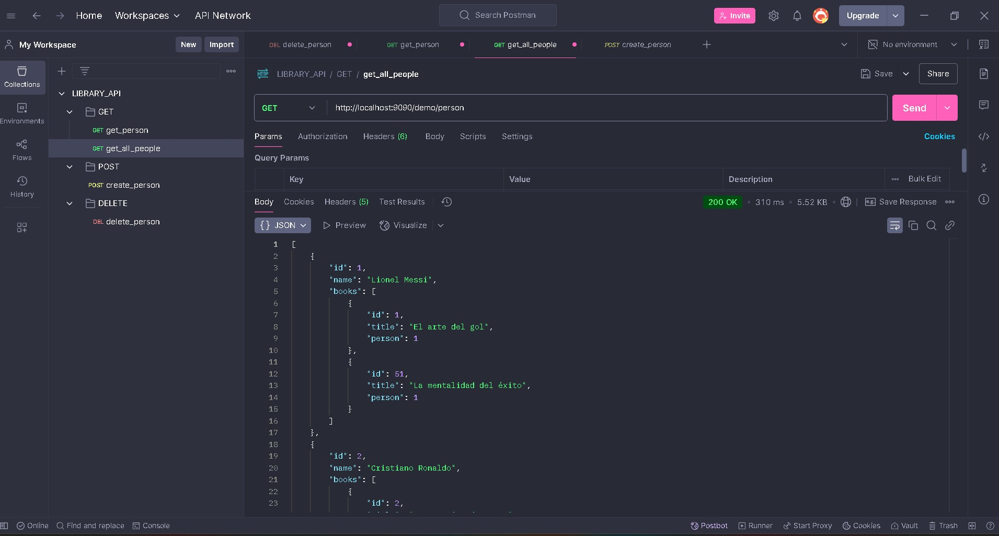
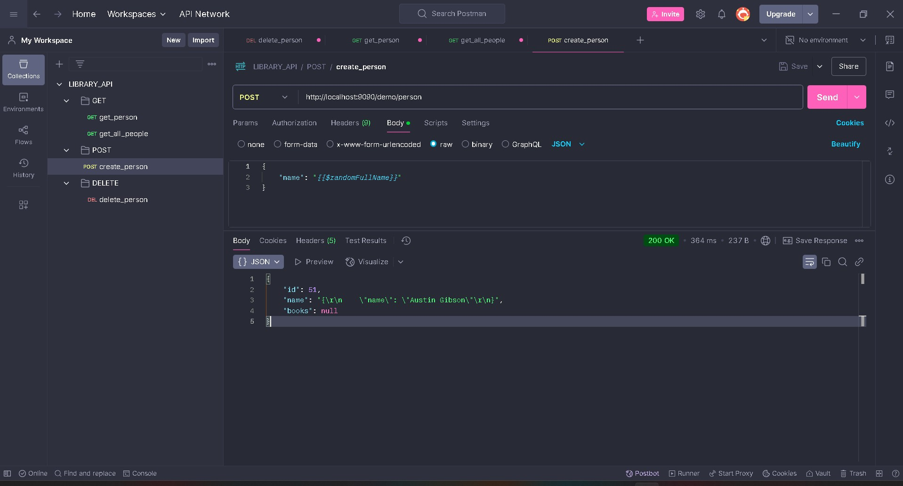
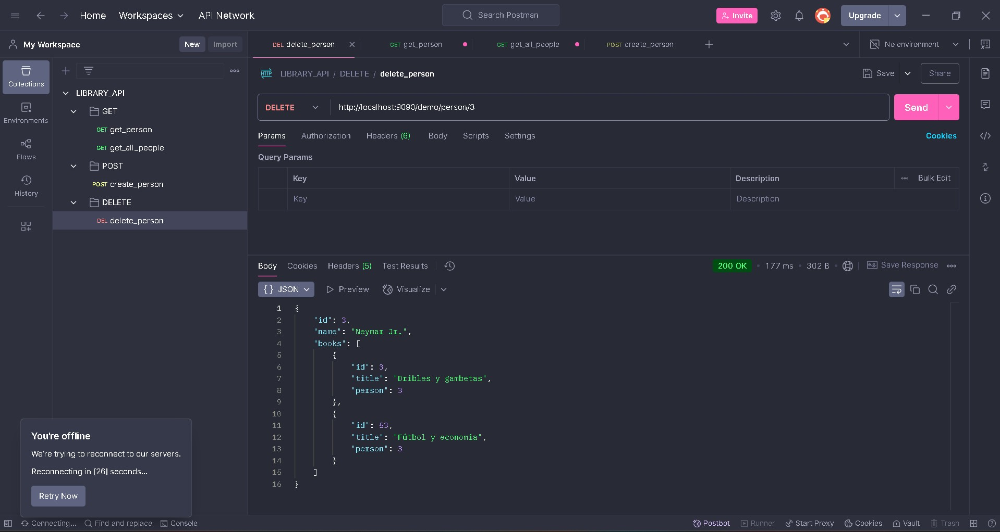
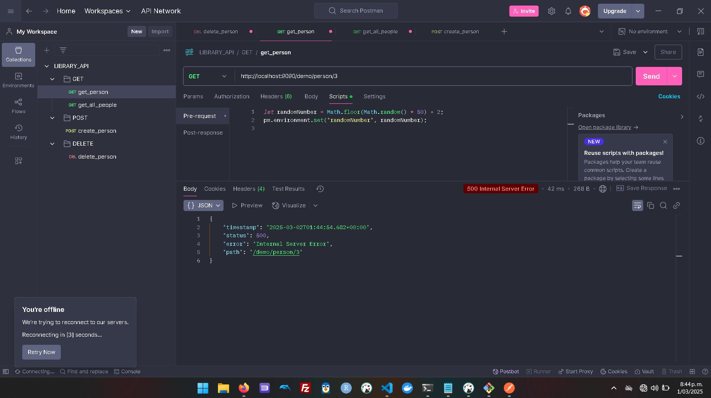
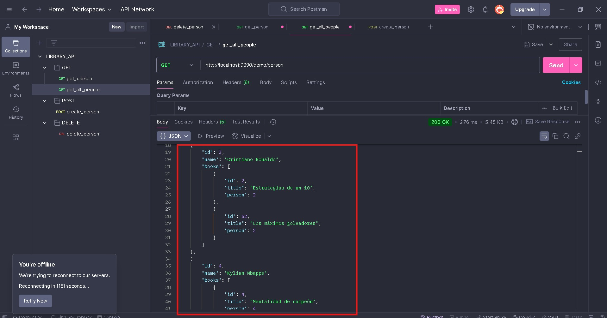

Library API - Person Endpoints 📚

This API provides operations to manage persons in the library system.

Postman Test:

Base URL

http://localhost:9090/demo/persons

📌 GET: Retrieve all persons

Endpoint:

List People:

GET /demo/person

Description:
Retrieves a list of all people registered in the system.

📌 POST: Create a new person

Endpoint:

POST /demo/persons

Description:
Creates a new person in the library system.

Request Body:

{
  "name": "Cristiano Ronaldo"
}

Response:

{
  "message": "Person created successfully",
  "id": 3
}

📌 DELETE: Remove a person by ID

Endpoint:

DELETE /demo/persons/{id}

Description:
Deletes a person by their ID.

Example Request:

DELETE /demo/persons/3

Response:

{
  "message": "Person deleted successfully"
}

⚠️ Error Handling

If a request fails, the API will return an error message:

{
  "timestamp": "2025-03-02T01:30:35.755+00:00",
  "status": 404,
  "error": "Person not found",
  "path": "/demo/persons/10"
}

verify:

Person with ID=3 isnt in database

Person isnt over there:

🛠️ Notes

Ensure the request body is in valid JSON format.

The DELETE operation is irreversible.

Use correct IDs when making DELETE or GET requests.

🚀 Happy coding!

